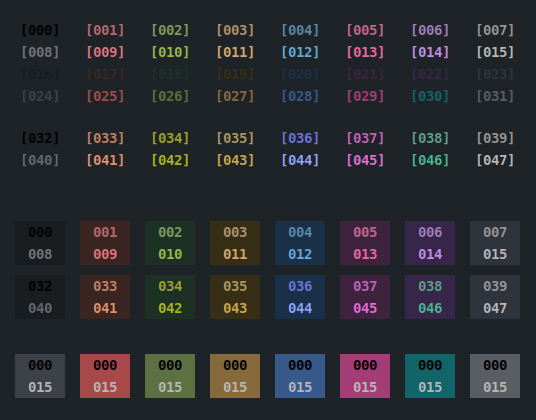

# LOST-IN-WONDER

Octets:
* **1** _normal_
* **2** _bright_
* **3** _background_
* **4** _shaded_

### Preview:



Build:
The default lightness may be too low for proper displaying of regular fonts.
You can increase base brightness and saturation by the use of two environment variables:

Preview first to get a sense of the look:

```bash
EXTRA_LIGHTNESS=10  EXTRA_SATURATION=5  ./preview/colored-ansi lost-in-wonder
```

And generate the theme for particular target(s) by using same method.
