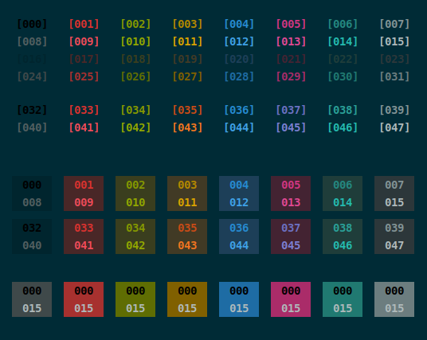

# Solarized [dark]

Octets:
* _normal_
* _bright_
* _background_
* _shaded_
* _accented_
* _bright_

Original [Solarized](https://ethanschoonover.com/solarized) contained 8 color accents.
To fit them into 6 accents _Orange_ and _Violet_ were placed in 5th and 6th (bright) octets.

### Preview:

